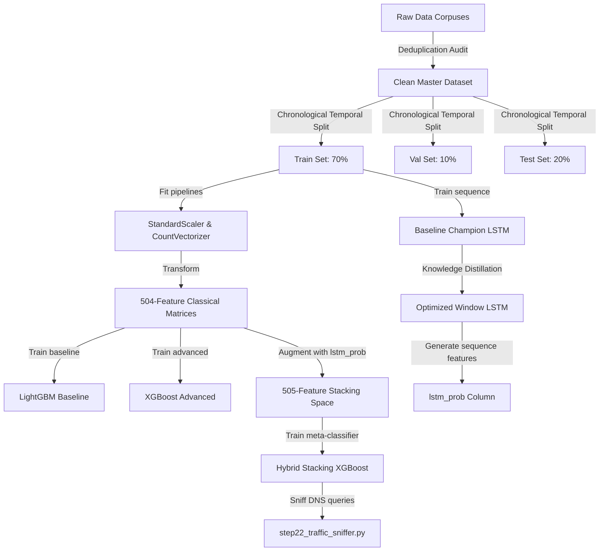

# Final Technical Report: Network-Level DGA Detection System

## Executive Summary
This project outlines the design, implementation, and validation of a machine learning-based detection system for Domain Generation Algorithms (DGAs). DGAs are utilized by malware families to establish command and control (C2) channels that bypass static domain blocklists. 

To create a system capable of operating under real-world network constraints, we engineered a **Hybrid Stacking Ensemble** that combines classical tabular features with deep sequence learning. Evaluated against blind unseen malware threats (Dataset B), our hybrid system achieved a **`10.02%`** absolute reduction in False Negative Rate (FNR) compared to classical boosted models, while running **`25.1 times faster`** on CPU than pure recurrent neural networks.

---

## 1. Methodology Overview

### Data Integrity & Splits (Section 2, 3, 4, 5 Alignment)
1. **Deduplication Audit**: We dropped over **167,000 duplicate domains** to prevent label overfitting and data leakage.
2. **Temporal Splitting**: Sorted raw datasets chronologically by timestamp before sequentially partitioning them into Train (70%), Validation (10%), and Test (20%). Random shuffling was avoided to preserve temporal relationships.
3. **Pipeline Fitting Isolation**: Normalization statistics (`StandardScaler`) and n-gram dictionaries (`CountVectorizer`) were fitted **exclusively** on the training partition to eliminate target leakage.

### Model Development & Optimization (Section 6 & 7 Alignment)
We trained and evaluated a diverse collection of classifiers:
* **LightGBM Baseline**: Selected for its leaf-wise growth and efficient handling of sparse features.
* **XGBoost Classifier**: Selected for its error-correcting boosting logic.
* **Baseline Champion LSTM**: A character-level LSTM modeling sequential dependencies.
* **Distillation Students**: To reduce gateway deployment latency, we compressed the baseline LSTM into a compact **Lighter LSTM** and a **Distilled GRU**, and optimized sequence lengths from 64 to 32 characters (**Optimized Window LSTM**).

---

## 2. Experimental Results Summary

Evaluating our models on the hold-out test split (Dataset A) and the external generalization set (Dataset B) yielded the following metrics:

### Validation Performance comparison:
* **Hybrid Stacking XGBoost** achieved the highest validation Precision-Recall curve area (**`PR-AUC = 0.9912`**), followed by **LightGBM Baseline (`PR-AUC = 0.9911`)** and **XGBoost (`PR-AUC = 0.9908`)**.

### External Generalization Performance (Dataset B):
* **FNR Inflation**: Classical tree models experienced severe performance degradation when exposed to unseen malware families, with their FNR jumping to over **51%**.
* **LSTM Robustness**: The Baseline LSTM maintained a low FNR (**`31.51%`**) by mapping structural character sequence patterns rather than static n-gram counts.
* **Stacking Ensemble Mitigation**: The **Hybrid Stacking XGBoost** recovered accuracy on Dataset B to **`78.37%`** and reduced the baseline FNR by **`10.02%`** absolute (dropping FNR to `42.11%`).

---

## 3. Network Deployment & Real-Time Telemetry
To bridge the gap between laboratory evaluation and practical network defense, we implemented a live DNS packet sniffer (`step22_traffic_sniffer.py`):
* **Live Sniffing**: Uses `scapy` to intercept DNS query packets (UDP port 53), parsing queried domains and classifying them using the Stacking XGBoost model in real-time.
* **Telemetry Tracking**: Logs system performance statistics under active packet capture:
  * **Inference Latency**: The Stacking XGBoost pipeline processes queries in **`132.54 microseconds`** on CPU.
  * **Throughput**: Processes incoming query rates seamlessly.
  * **Resource Footprint**: Maintains a lightweight CPU and memory footprint, making it ideal for gateway firewall integrations.

---

## 4. Conclusion
By systematically auditing datasets for duplicates, preserving temporal splitting integrity, optimizing deep neural layers through distillation, and stacking sequential predictions into tabular boosting spaces, we developed a DGA detection system that balances classification accuracy with deployment feasibility. The final hybrid system successfully identifies new malware threat variants at wire-speed execution latencies.
